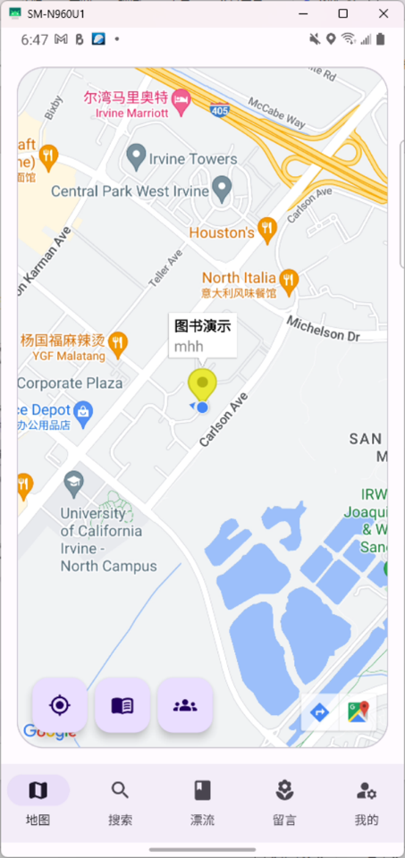
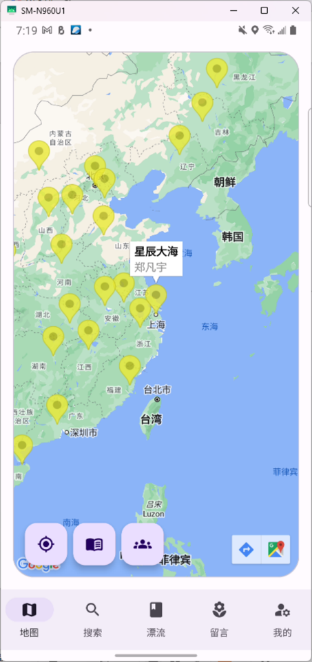

# Book Crosser

## Introduction

Welcome to [Book Crosser], an innovative Android application built using Kotlin and the latest UI toolkit, Jetpack Compose. This project adopts the MVI (Model-View-Intent) architecture and is styled with Material Design 3, ensuring a modern and seamless user experience. Additionally, it integrates Google Maps Compose API for rich mapping features.

## 📱Shortcut

## Features

- **Modern Kotlin-Based Application**: Utilizing the powerful and concise language features of Kotlin for Android development.
- **Jetpack Compose UI**: Building intuitive and dynamic UIs with less code using Compose UI.
- **MVI Architecture**: Ensuring a predictable and manageable state in the app by following the Model-View-Intent pattern.
- **Material Design 3**: Incorporating the latest Material Design guidelines for a visually appealing and responsive interface.
- **Google Maps Compose Integration**: Embedding interactive maps directly into the app’s interfaces with Google Maps Compose API.

## Getting Started

## Contact

For any questions or suggestions, please reach out to us at [mohuaihaoxm@gmail.com](mailto:mohuaihaoxm@gmail.com).
